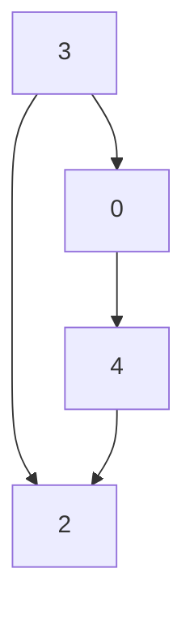

# Linked List Cycle

Given _head_, the head of a linked list, determine if the linked list has a cycle in it.\
There is a cycle ina linked list if there's some node in the list that can be reached again by contiunously following the _next_ pointer. Internally, _pos_ is used to denote the index of the node that tail's _next_ pointer is connected to.\
**Note that _pos_ is not passed as a parameter**\
Return **true** if there's a cycle in the linked list. Otherwise, return false.

## Example 1

