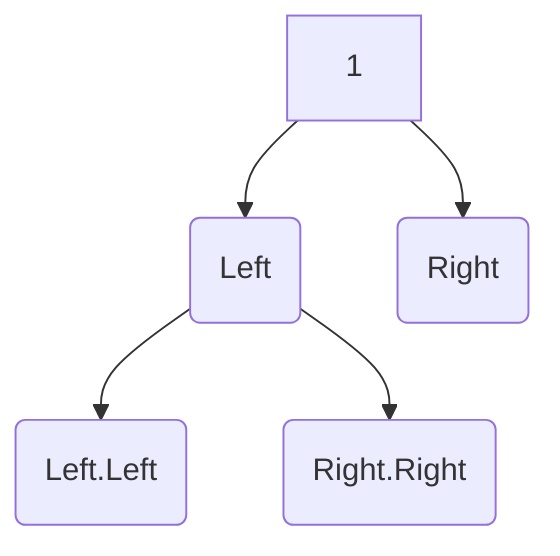

# Diameter of binary tree

Given the **root** of a binary tree, return the _length_ of the longest path between any two nodes in a tree. \
This path may or may not pass though the _root_.

The length of a path between two nodes is represented by the number of edges between them. \

## Example 1

`Input: root = [1,2,3,4,5]`\
`Output: 3`\
`Explaination: 3 is the length of the path [4,2,1,3] or [5,2,1,3]`\
